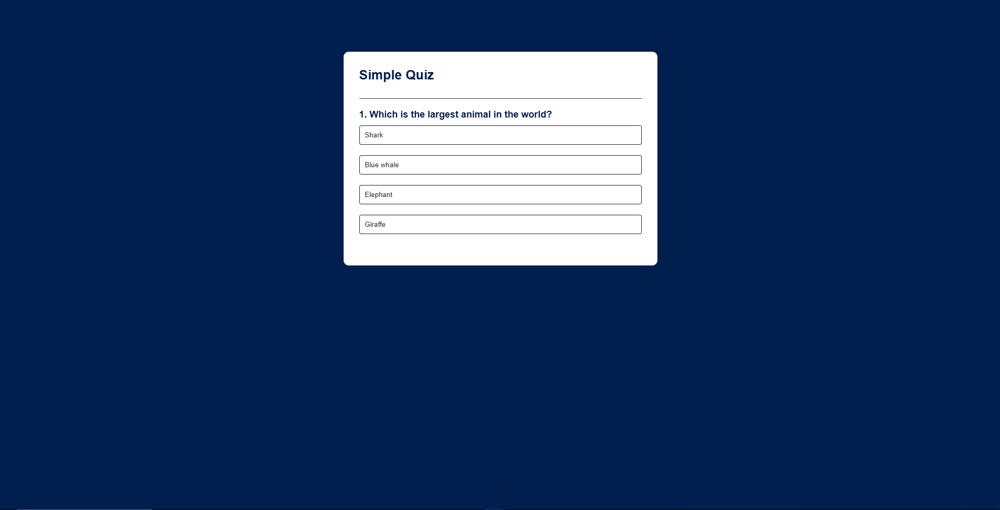

# Quiz App

A simple quiz application built with HTML, CSS, and JavaScript.

## Version 1.0 – Tutorial Implementation

This project was created by following a YouTube tutorial in order to practice core JavaScript concepts such as:

- DOM manipulation
- event handling
- dynamic UI updates
- basic application state (score, current question)

Tutorial followed:
https://www.youtube.com/watch?v=PBcqGxrr9g8

The goal of this version was to understand how a quiz application works and how JavaScript interacts with the DOM.

## Technologies Used

- HTML
- CSS
- JavaScript

## How to Run

1. Download or clone the repository
2. Open `index.html` in your browser

## Future Improvements (Version 2.0)

After completing the tutorial version, the next step is to improve and expand the project by:

- Refactoring the code structure
- Improving the user interface
- Adding new features
- Enhancing the quiz logic

## Screenshot (v1.0)

## Version 2.0 – Improvements (In Progress)

This version focuses on improving code quality, readability, and expanding the functionality of the quiz application beyond the original tutorial implementation.

### Completed Improvements

**Code Quality**
- Refactored functions to modern ES6 arrow function syntax for improved consistency.
- Organised the JavaScript file into clear section blocks to improve readability.

**User Experience**
- Added a progress indicator showing the current question number (e.g. Question 2 / 4).
- Added performance feedback after the quiz based on the final score.
- Implemented a restart button allowing users to play the quiz again.

**Quiz Logic Enhancements**
- Randomised question order each time the quiz starts to make the experience less predictable.

### Planned Improvements

**Quiz Logic Enhancements**
- Randomise answer order to prevent memorisation patterns.

**Future Feature**
- Load quiz questions from an external file instead of hardcoding them in the JavaScript code. This would allow users to easily generate quizzes on different topics by editing the question file.
