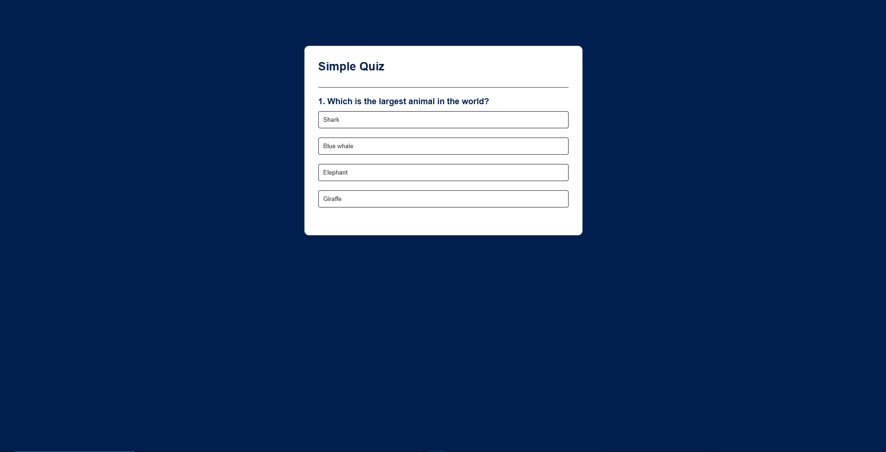
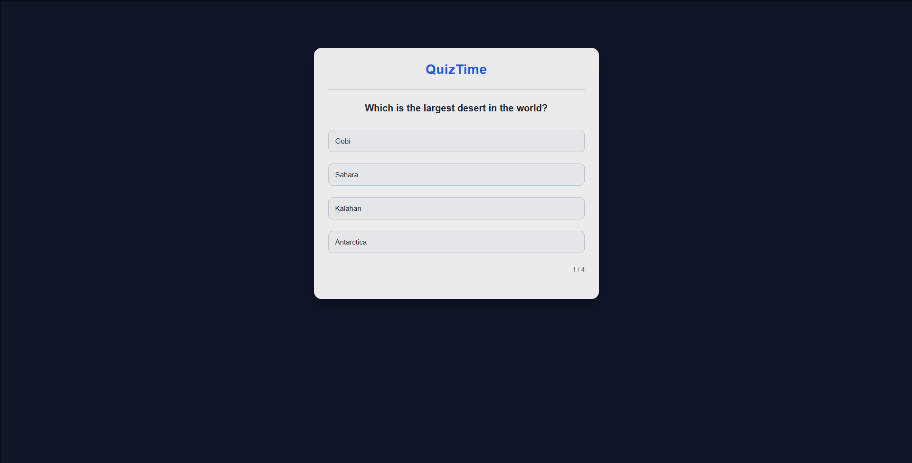

# QuizTime – Study Made Easy

A modern quiz application built with HTML, CSS, and JavaScript.

This project started as a tutorial-based application and was progressively improved into a more polished, interactive, and reusable quiz experience.

---

## Version 1.0 – Tutorial Implementation

This project was initially created by following a YouTube tutorial to practise core JavaScript concepts such as:

- DOM manipulation  
- Event handling  
- Dynamic UI updates  
- Basic application state (score, current question)  

Tutorial followed:  
https://www.youtube.com/watch?v=PBcqGxrr9g8

The goal of this version was to understand how a quiz application works and how JavaScript interacts with the DOM.

---

## Screenshot (v1.0)

---

## Version 2.0 – Final Version

Version 2 expands the original tutorial project by improving the code structure, user experience, and quiz logic, transforming it into a complete and reusable application.

---

## Features

- Interactive multiple-choice quiz  
- Randomised question order on each playthrough  
- Randomised answer order to prevent memorisation  
- Progress indicator (e.g. **1 / 4**)  
- Performance feedback based on final score  
- Restart quiz functionality  
- External JSON-based question loading  

---

## Technologies Used

- HTML  
- CSS  
- JavaScript  

---

## Screenshot (v2.0)

---

## How to Run

1. Clone or download the repository  
2. Run the project using a local server (e.g. VS Code Live Server)  
3. Open `index.html` in your browser  

---

## Customising Quiz Questions

You can easily create your own quizzes by editing the `questions.json` file.

### How to customise your questions

1. How to Create a New Quiz
2. Open the questions.json file
3. Delete the existing questions if you want to replace them
4. Use an AI tool to generate new questions using the example prompt below
5. Copy the generated output into questions.json
6. Save the file
7. Refresh the app in your browser

### Example AI Prompt

Give me (input number of desired questions) multiple-choice quiz questions in JSON format.

Use this exact structure:

[
  {
    "question": "Question here",
    "answers": [
      { "text": "Option 1", "correct": false },
      { "text": "Option 2", "correct": true },
      { "text": "Option 3", "correct": false },
      { "text": "Option 4", "correct": false }
    ]
  }
]

Rules:
- Return valid JSON only
- Each question must have 4 answers
- Only 1 answer should be correct
- Do not include explanations

Topic: (input topic)

---

# End
I hope this quiz app helps you study enjoy :).

